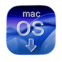
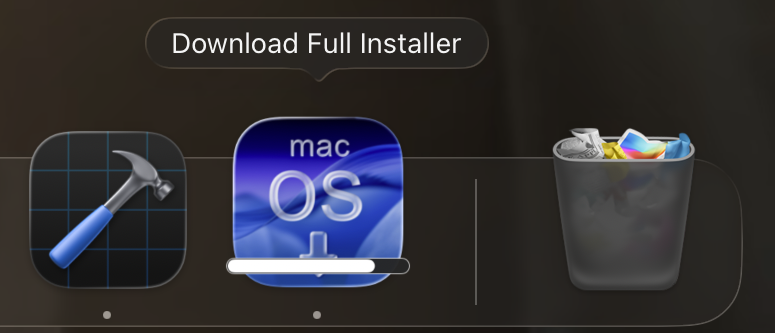
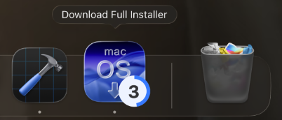
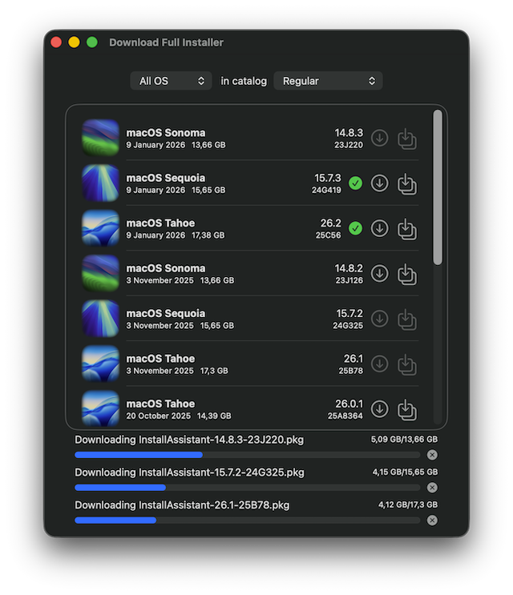
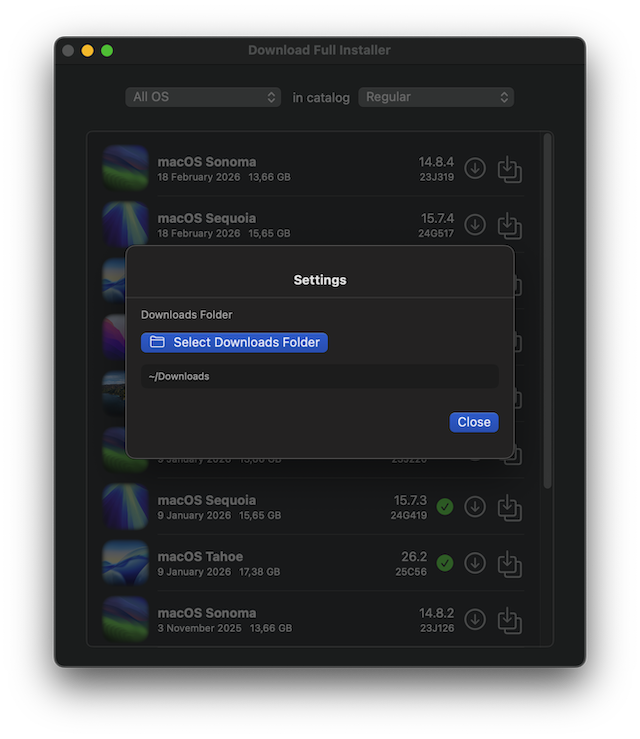
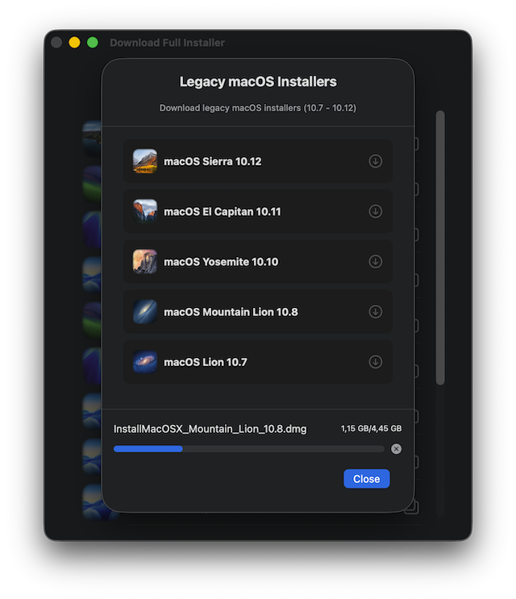

# Changelog

All GitHub releases listed from first to latest. Releases from the [`old`](https://github.com/perez987/DownloadFullInstaller/tree/old) branch (macOS 11+) are under title `old` branch; all others belong to the `main` branch (macOS 13+).

# `main` branch

## 2.0.3 -  August 31, 2025

**Standalone repository**

New repo not forked from the source.

Initial contributors:

- [chris1111](https://github.com/chris1111): Quit the application by closing the window from the red button / Add French and Canadian French languages
- [Anto65](https://github.com/antuneddu): Add Italian language 
- [ClassicUA](https://github.com/ClassicUA): Add Ukrainian language.

## 2.1.0 -  September 15, 2025

**App for macOS 13+**

Package of changes and improvements:

- Option to delete preferences plist file, simulating a first run
- Revise language flow
- Update localization strings for all supported languages
- Clean up debug print statements
- Bump to 2.1.0 version
- Add language selection system
- Add restart alert to language selection view
- Add option to clear app's saved settings
- Update translations with new strings
- Add flag icons to language selection view

## 2.2.1 -  September 19, 2025

**New app icon**

- New app icon more Tahoe style, thanks to [Anto65](https://github.com/antuneddu)

## 2.2.0 -  September 23, 2025

**Support for resuming downloads**

- Add download resume functionality that automatically handles network interruptions

## 2.2.2 -  September 29, 2025

**Add Russian localization**

- Add Russian localization (thanks _Vladislav Strekalin_)
- Changed language selector size

## 2.5.0 -  October 28, 2025

**Create macOS Installer app**

- Create the macOS installer application (e.g., "Install macOS Sequoia.app") directly from within Download Full Installer

## 2.6.0 -  November 28, 2025

**Dock icon progress bar**

- The package [DockProgress](DOCS/DockProgess.md) adds progress bar or badge overlay to the application's dock tile icon during PKG downloads

## 2.7.0 -  November 30, 2025

**Active download count**

- Displays active download count in the badge style of DockProgress

## 3.0.0 -  December 1, 2025

**3 Simultaneous downloads**

- Enables multiple concurrent downloads (max 3) with individual progress tracking and cancellation

## 3.0.1 -  December 2, 2025

**Fix alerts issue**

- Unify alert handling in InstallerView: refactored InstallerView

## 3.0.2 -  December 3, 2025

**Centralize alert handling**

- Centralize alert handling adding `Alert+Extensions.swift` to define all alert types, titles, messages, and button configurations in one place: [more info](DOCS/Alert-extension.md)

## 3.0.3 -  December 8, 2025

**Refactor SUCatalog loading**

- `Swiftformat`: refactor and clean up codebase
- Refactor SUCatalog loading

## 3.0.4 -  December 24, 2025

**Add visual indicator**

- Add visual indicator for downloaded installers
- Downgrade DockProgress to 4.3.1 for Xcode 15.4 compatibility

## 3.2.0 -  January 13, 2026

**Add Korean language**

- Added Korean language support, thanks to [VenusGirl](https://github.com/VenusGirl)
- Bump version to 3.2.0

## 3.5.0 -  January 18, 2026

**Custom download folder**

- Introduces a new SettingsView for download folder selection
- DownloadManager and MultiDownloadManager now use security-scoped bookmarks for custom download folders, improving sandbox compatibility
- Updated localizable strings and translations
- Project version bumped to 3.5.0

## 3.6.0 -  January 20, 2026

**Temporary directory cleanup**

- Added Arabic (ar) localization support, including InfoPlist.strings and Localizable.strings
- Implemented temporary directory cleanup after download cancellation (to prevent large files from incomplete downloads from being stored indefinitely)
   - For sandboxed apps, the temporary directory is `~/Library/Containers/perez987.DownloadFullInstaller/Data/tmp`
- Converted the language list to a vertical ScrollView

## 3.7.0 -  January 24, 2026

**Add Slovenian language**

- Added Slovenian language, thanks to [anderlli0053](https://github.com/anderlli0053)

## 3.8.0 -  January 26, 2026

**Reorder languages list**

- Prioritize English and Spanish in language list order

## 3.9.0 -  January 26, 2026

**Language selector rows**

- Make entire language selector row clickable

## 3.9.1 -  January 28, 2026

**Round corners installers list**

- Add corner radius to installers list in `ContentView.swift`

## 4.0.0 -  February 2, 2026

**Legacy macOS downloads**

- Added legacy macOS installer support (10.7-10.12); [more info](DOCS/Legacy-macos.md)
- Fix sandbox issues
- Add an explicit Info.plist with ATS exceptions
- Bump marketing and build versions to 4.0 (202)
- Legacy macOS icons, thanks to [chris1111](https://github.com/chris1111)

## 4.0.1 -  February 3, 2026

**Minor UI fixes**

- Ensure `LanguageSelectionView` syncs the `selectedLanguage` at first startup
- Reduce `LegacyVersionRow` height for a tighter row layout
- Remove Info.plist from Resources build phase

## 4.1.0 -  February 26, 2026

**Universal architecture**

- Universal architecture (Intel + Silicon)
- Embed DockProgress package 4.3.1, the last release with Xcode 15 / macOS Sonoma support

# `old`branch

## 2.0.0 – September 14, 2025

- Refactor Preferences logic
- Remove localization (English default)
- Simplified localization system

## 2.0.1 – September 22, 2025

- Asset icons as badges Tahoe style, thanks to [chris1111](https://github.com/chris1111)
- Add languages: Ukrainian (thanks _Vladislav Strekalin_) and Simplified Chinese

## 2.1.0 – November 2, 2025

- Create the macOS installer application (e.g., "Install macOS Big Sur.app") directly from within Download Full Installer

## 2.5.0 – February 25, 2026

- `old` branch has been updated to include the functionalities of the `main` branch with these differences:
   - The same languages ​​are supported, but without a language selector
   - No temporary directory cleanup on app quit
- For users requiring to run the app on macOS 11 -12

## 2.5.1 – February 26, 2026

- Added temporary directory cleanup on app quit
- For sandboxed apps, this is `~/Library/Containers/perez987.DownloadFullInstaller/Data/tmp`

