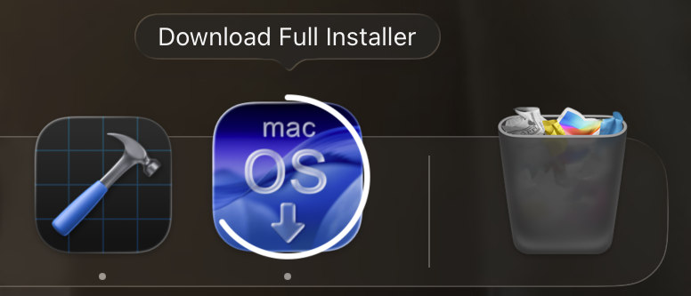
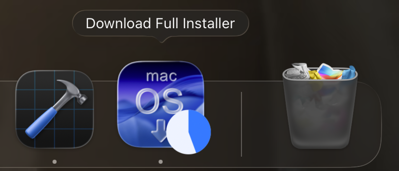

# DockProgress Package

This document describes the integration of the `DockProgress` package into Download Full Installer. The package adds a progress bar overlay to the application's dock tile icon during PKG downloads.

## Package Details

- **Repository**: https://github.com/sindresorhus/DockProgress
- **Version**: 5.0.2
- **License**: MIT
- **macOS Requirement**: 10.14+

### Install

Add `https://github.com/sindresorhus/DockProgress` in the “Swift Package Manager” tab in Xcode.

### Import

```swift
import DockProgress
```

`import` is added to `DownloadManager.swift` and `MultiDownloadManager.swift`.

## Implementation

### Style Configuration

DockProgress supports multiple built-in styles.

```swift
DockProgress.style = .bar
DockProgress.style = .squircle(color: .white.opacity(0.5))
DockProgress.style = .circle(radius: 55, color: .blue)
DockProgress.style = .badge(color: .blue, badgeValue: { getDownloadCount() })
DockProgress.style = .pie(color: .blue)
```

### Progress Updates

The `DockProgress.progress` property accepts a `Double` value from 0.0 to 1.0:

```swift
DockProgress.progress = self.progress
```

### Main Actor Isolation

DockProgress properties (`style` and `progress`) are `@MainActor`-isolated static properties. All calls must be wrapped in `DispatchQueue.main.async` to avoid Swift concurrency errors:

```swift
DispatchQueue.main.async {
    DockProgress.style = .bar
    DockProgress.progress = 0.0
}
```

## DownloadManager.swift

### 1. Download Start

When a download begins, the dock progress style is set and progress is initialized (`startDownload()`):

```swift
// Set dock progress style to bar
DispatchQueue.main.async {
    DockProgress.style = .bar
}

// Initialize progress for new downloads
if resumeData == nil {
    DispatchQueue.main.async {
        DockProgress.progress = 0.0
    }
}
```

### 2. Progress Updates

Progress is updated as data is received (`didWriteData`):

```swift
DispatchQueue.main.async {
    self.progress = Double(totalBytesWritten) / Double(totalBytesExpectedToWrite)
    DockProgress.progress = self.progress
}
```

### 3. Resume Updates

When a download is resumed, the progress is updated from the resume offset (`didResumeAtOffset`):

```swift
DispatchQueue.main.async {
    self.progress = Double(fileOffset) / Double(expectedTotalBytes)
    DockProgress.progress = self.progress
}
```

### 4. Download Completion

On successful completion, the dock progress is reset (`didFinishDownloadingTo`):

```swift
DispatchQueue.main.async {
    DockProgress.progress = 0.0
}
```

### 5. Cancellation

When the user cancels a download (`cancel()`):

```swift
DispatchQueue.main.async {
    DockProgress.progress = 0.0
}
```

### 6. Error Handling

On max retry attempts or non-recoverable errors, the dock progress is cleared:

```swift
DispatchQueue.main.async {
    DockProgress.progress = 0.0
}
```

## Available Styles

While this project uses `.bar`, DockProgress supports these built-in styles:

- `.bar` - Horizontal progress bar (used in this project)


- `.circle` - Circular progress indicator



- `.pie` - Circular progress like a slice of pie



-  `.squircle` - Fits around macOS app icons
- `.badge` - Badge-style progress showing a number

### Badge Style with Download Count

The project includes a `getDownloadCount()` function in `DownloadManager.swift` that tracks the number of active downloads. This can be used with the badge style to display the active download count on the dock icon:

```swift
DockProgress.style = .badge(color: .blue, badgeValue: { DownloadManager.getDownloadCount() })
```

The download count is:
- Incremented when a new download starts
- Decremented when a download completes successfully, is cancelled, or fails

This implementation is thread-safe and designed for future multi-download support.


## Troubleshooting

### Swift Concurrency Errors

If you see errors like:
```
Main actor-isolated static property 'progress' can not be mutated from a nonisolated context
```

Ensure all DockProgress calls are wrapped in `DispatchQueue.main.async { }`.

### Progress Bar Not Visible

1. Verify the dock icon is visible in the Dock
2. Check that `DockProgress.style` is set before updating `progress`
3. Ensure progress values are between 0.0 and 1.0
