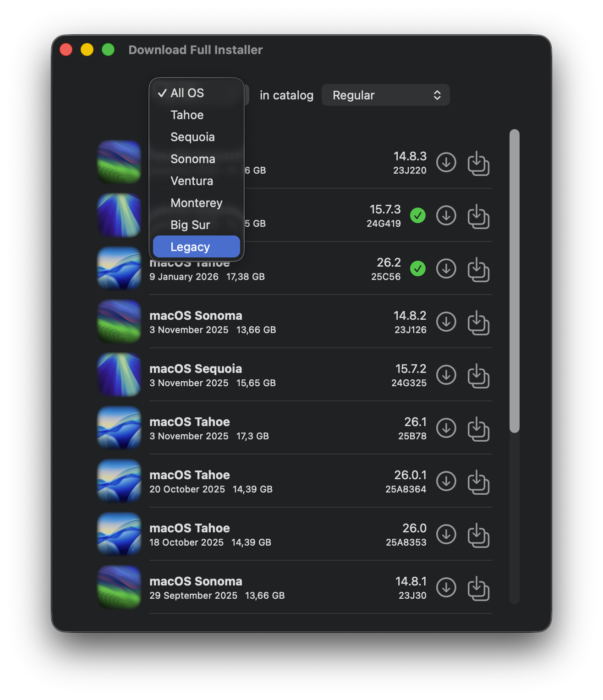
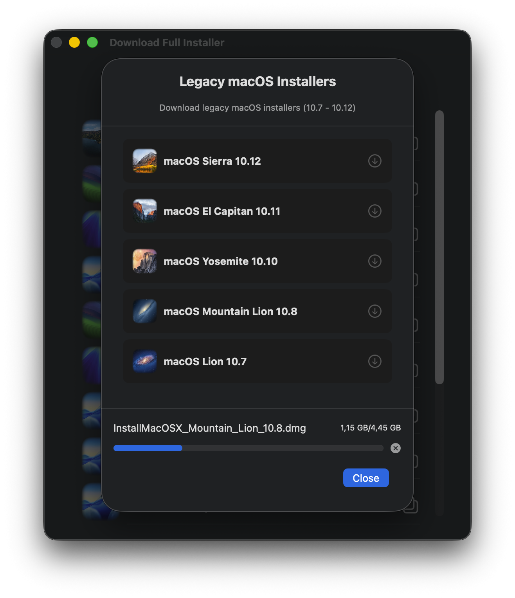

# Download legacy macOS

### Preface

There may be users interested in obtaining legacy versions of macOS, prior to Big Sur.  [5T33Z0](https://github.com/5T33Z0) has proposed adding this to Download Full Installer as a way to complement the app or add an extra feature. The most significant challenge is finding direct links to legacy versions of macOS that can be integrated into Download Full Installer without requiring extensive code modifications.

There is a support article by Apple on "[How to download and install macOS](https://support.apple.com/en-us/102662)” with a section called "Use a web browser for older versions" that contains direct download links for macOS Lion to Sierra:

- [macOS Sierra 10.12](http://updates-http.cdn-apple.com/2019/cert/061-39476-20191023-48f365f4-0015-4c41-9f44-39d3d2aca067/InstallOS.dmg) 
- [OS X El Capitan 10.11](http://updates-http.cdn-apple.com/2019/cert/061-41424-20191024-218af9ec-cf50-4516-9011-228c78eda3d2/InstallMacOSX.dmg) 
- [OS X Yosemite 10.10](http://updates-http.cdn-apple.com/2019/cert/061-41343-20191023-02465f92-3ab5-4c92-bfe2-b725447a070d/InstallMacOSX.dmg) 
- [Mac OS X Mountain Lion 10.8](https://updates.cdn-apple.com/2021/macos/031-0627-20210614-90D11F33-1A65-42DD-BBEA-E1D9F43A6B3F/InstallMacOSX.dmg) 
- [Mac OS X Lion 10.7](https://updates.cdn-apple.com/2021/macos/041-7683-20210614-E610947E-C7CE-46EB-8860-D26D71F0D3EA/InstallMacOSX.dmg)

These legacy systems use a different method than Big Sur and later systems. While the latter download a PKG installer, differentiate between versions, that can easily be converted into the Install macOS app, the legacy systems have a single link to the latest available version of each system and download a DMG disk image containing the PKG installer.

Therefore, they cannot be downloaded in the same way as the rest of the macOS available in the drop-down list in Download Full Installer, since this application is designed for Big Sur and later versions.

### Implementation

A new item called Legacy has been added to the macOS systems dropdown list. Legacy opens a new window listing the five legacy macOS versions mentioned above, each with its own direct download link. You can download any of these legacy macOS versions from this window.

| Drop-down list | Legacy download |
|:---:|:---:|
|  |  

Legacy downloads are managed similarly to modern downloads:

- They can be canceled before completion
- The download destination folder is the one configured in the app settings.

### Only 5 versions?

So far, I haven't found any direct links on Apple's servers to these macOS versions prior to Big Sur: Catalina 10.15, Mojave 10.14, High Sierra 10.13, and Mavericks 10.9.

I'll try to find a way to add them to the app but, for now, the only macOS systems you can get are: macOS Sierra 10.12, OS X El Capitan 10.11, OS X Yosemite 10.10, OS X Mountain Lion 10.8, and Mac OS X Lion.

### Clean up incomplete downloads on app quit

Incomplete downloads may accumulate in the sandboxed temp directory 
`~/Library/Containers/perez987.DownloadFullInstaller/Data/tmp` 
consuming disk space indefinitely. The cleanup safely removes regular files (not directories) from `NSTemporaryDirectory()`, which resolves to the sandboxed temp path. Individual file deletion failures don't halt the overall cleanup process.
