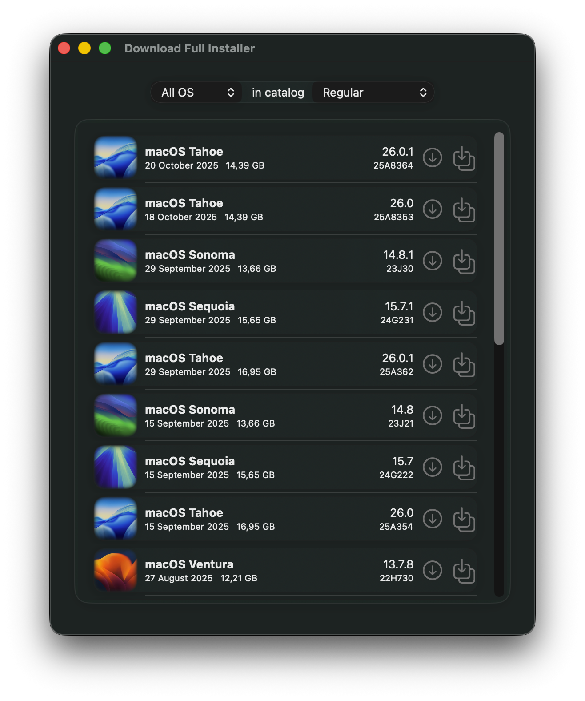
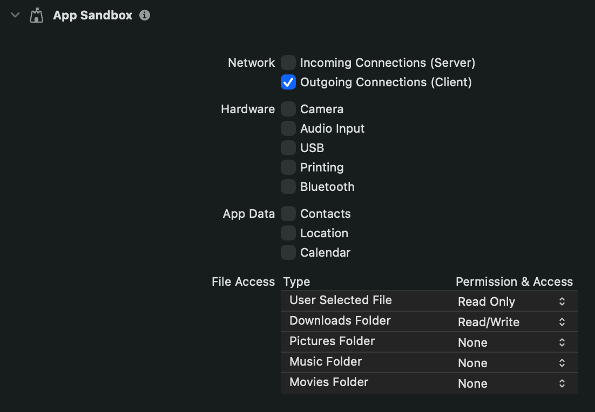

# Download Full Installer

A partir de junio de 2025, [DownloadFullInstaller](https://github.com/scriptingosx/DownloadFullInstaller) de <em>scriptingosx</em> fue archivado por el desarrollador. Durante más de tres años, mi repositorio DownloadFullInstaller fue una bifurcación del original. Sin embargo, tras archivarlo, creé un nuevo repositorio que es una versión independiente (no bifurcada). Mantendré este proyecto activo y actualizado mientras sea útil para otros usuarios.

### Download Full Installer desde macOS 13 hasta macOS 26

Download Full Installer funciona desde macOS 13 Ventura hasta macOS 26 Tahoe.

**Nota**: Para utilizar Download Full Installer en macOS 11 o posterior, puedes obtener la [versión 2.0](https://github.com/perez987/DownloadFullInstaller/releases/tag/2.0-139) o el proyecto Xcode de la rama [`old`](https://github.com/perez987/DownloadFullInstaller/tree/old) y compilar la aplicación desde el código fuente.

### Características

- Actualizado hasta macOS 26 Tahoe
- El proyecto Xcode requiere macOS 13 Ventura o posterior
- Las preferencias para elegir el catálogo ya no son un cuadro de diálogo independiente, sino que ahora se encuentran en la parte superior de la ventana principal
- Se puede mostrar una o todas las versiones de macOS a la vez
- Se ha añadido lógica para prevenir la suspensión del sistema mientras se ejecuta la aplicación
- Se ha añadido un sistema de selección de idioma
- Traducciones actualizadas
- Compatibilidad inicial con Liquid Glass con retrocompatibilidad
- Se ha añadido la función de reanudación de descarga que gestiona automáticamente las interrupciones de red
- Se ha añadido una barra de progreso superpuesta al icono del mosaico del dock de la aplicación durante las descargas de PKG
- Se ha añadido compatibilidad con hasta 3 descargas simultáneas

**Nota**: No todas las funciones están disponibles en la versión macOS 11+

#### Función para crear la aplicación de instalación

Después de descargar el archivo InstallAssistant.pkg, puedes crear la aplicación de instalación de macOS (por ejemplo, "Instalar macOS Sequoia.app") directamente desde "Download Full Installer":

1. Descarga el PKG de instalación usando el botón de descarga (↓).
2. Haz clic en el botón "Crear aplicación de instalación" junto al botón de descarga.
3. El archivo PKG se abrirá con el instalador estándar de macOS.
4. Sigue las instrucciones en pantalla para completar la instalación.
5. El instalador de macOS se crea en la carpeta `/Aplicaciones`.

### La aplicación está dañada y no se puede abrir.

Si ves el mensaje `La aplicación está dañada y no se puede abrir` al abrir Download Full Installer por primera vez, lee este [documento](DOCS/App-damaged-es.md).

### La descarga parece haberse completado, pero el instalador no está en la carpeta Descargas.

La primera vez que uses la aplicación desde Xcode, puede parecer que la descarga se completa, con la cantidad de GB descargados según lo esperado, pero el instalador no está en la carpeta Descargas. Download Full Installer tampoco muestra el botón "Mostrar en el Finder".

Para solucionar esto, ve a la configuración Sandbox en «Xcode» ➡️ «Target» ➡️ «Firma y capacidades» ➡️ «Sandbox» para otorgar permisos de lectura y escritura a la carpeta Descargas.

