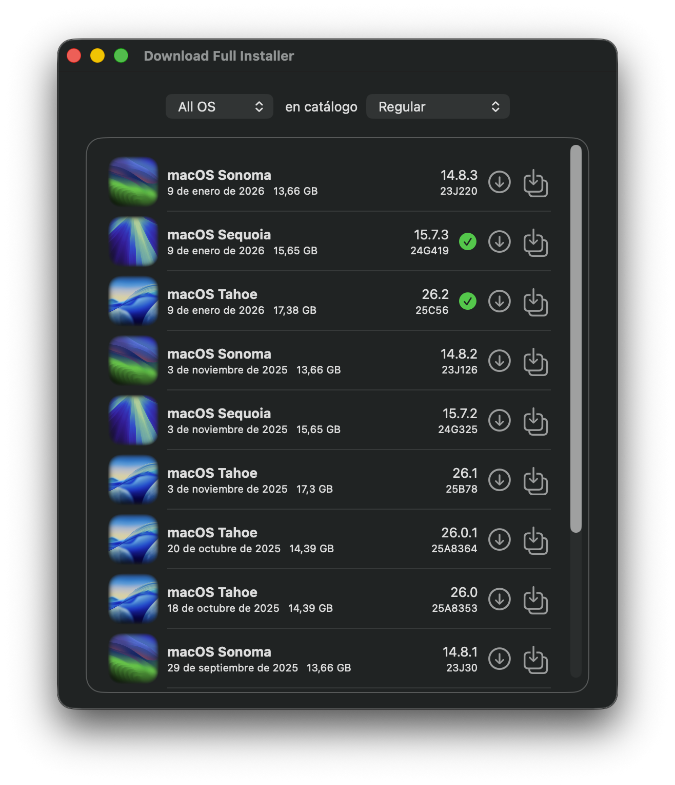
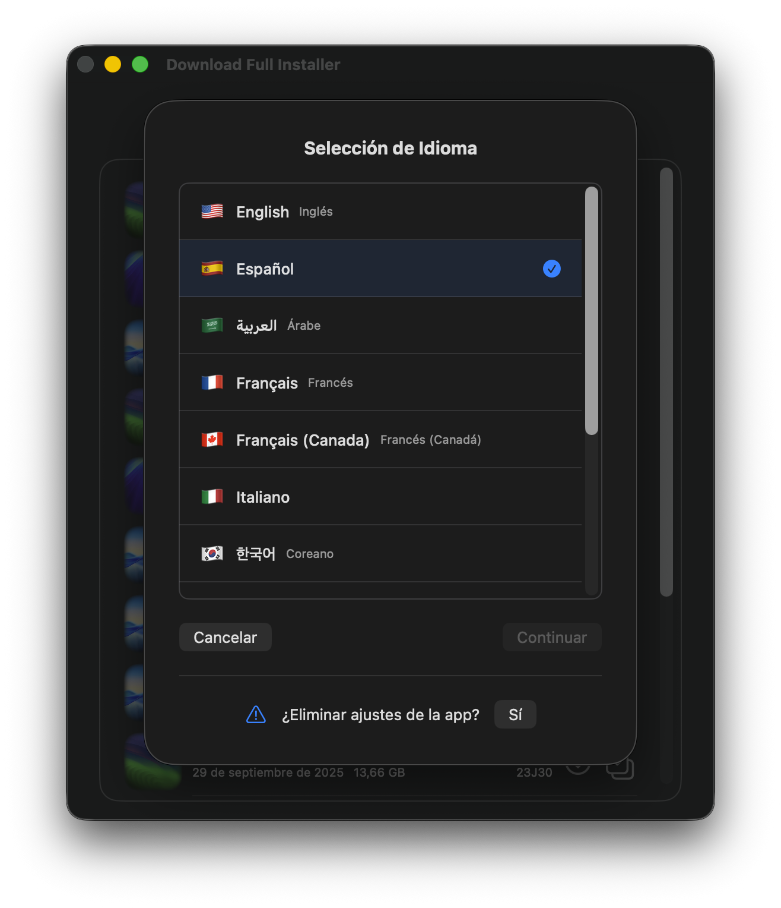

# Download Full Installer

  

A partir de junio de 2025, [DownloadFullInstaller](https://github.com/scriptingosx/DownloadFullInstaller) de <em>scriptingosx</em> detuvo su desarrollo. Durante más de tres años, mi repositorio DownloadFullInstaller fue una bifurcación del original. Sin embargo, después de que el original fue archivado, creé un nuevo repositorio que es una versión independiente (no bifurcada). Mantendré este proyecto activo y actualizado mientras sea útil para otros usuarios.

### Download Full Installer desde macOS 13 hasta macOS 26

Download Full Installer funciona desde macOS 13 Ventura hasta macOS 26 Tahoe.

**Nota**: Para utilizar Download Full Installer en macOS 11 o posterior, puedes obtener la [versión 2.5.1](https://github.com/perez987/DownloadFullInstaller/releases/tag/2.5.1) o el proyecto Xcode de la rama [`old`](https://github.com/perez987/DownloadFullInstaller/tree/old) y compilar la aplicación desde el código fuente.

### Características

- Actualizado hasta macOS 26 Tahoe
- El proyecto Xcode requiere macOS 13 Ventura o posterior
- Las preferencias para elegir el catálogo ya no son un cuadro de diálogo independiente, sino que ahora se encuentran en la parte superior de la ventana principal
- Se puede mostrar una o todas las versiones de macOS a la vez
- Se ha añadido lógica para prevenir la suspensión del sistema mientras se ejecuta la aplicación
- Se ha añadido un sistema de selección de idioma
- Traducciones actualizadas
- Se ha añadido la función de reanudación de descarga que gestiona automáticamente las interrupciones de red
- Se ha añadido una barra de progreso superpuesta al icono del mosaico del dock de la aplicación durante las descargas de PKG
- Se ha añadido compatibilidad con hasta 3 descargas simultáneas
- Se ha añadido la capacidad de personalizar el directorio de las descargas
- Se ha añadido un verificador de actualizaciones integrado que utiliza la API de GitHub Releases (sin dependencia de Sparkle); más información en este [documento](DOCS/Updater-system.md)

**Nota**: No todas las funciones están disponibles en la versión macOS 11+

#### Función para crear la aplicación de instalación

Después de descargar el archivo InstallAssistant.pkg, puedes crear la aplicación de instalación de macOS (por ejemplo, "Instalar macOS Sequoia.app") directamente desde "Download Full Installer":

1. Descarga el PKG de instalación usando el botón de descarga (↓).
2. Haz clic en el botón "Crear aplicación de instalación" junto al botón de descarga.
3. El archivo PKG se abrirá con el instalador estándar de macOS.
4. Sigue las instrucciones en pantalla para completar la instalación.
5. El instalador de macOS se crea en la carpeta `/Aplicaciones`.

#### Ajustes para seleccionar la carpeta de descargas

El menú "Acerca de este hack" -> Ajustes (⌘,) abre una ventana donde puedes seleccionar una carpeta diferente para los instaladores descargados. La carpeta predeterminada es ~/Descargas. Los indicadores visuales (marcas verdes) de los instaladores descargados se actualizan para coincidir con los de la carpeta seleccionada.

#### Ventana de selección de idioma

La ventana de idiomas puede ser abierta desde la barra de menús (`Idiomas` > `Selección de Idioma`) o por teclado (`⌘ + L`).

### La aplicación está dañada y no se puede abrir.

Si ves el mensaje `La aplicación está dañada y no se puede abrir` al abrir Download Full Installer por primera vez, lee este [documento](DOCS/App-damaged-es.md).

# README del repositorio original
(por scriptingosx)

### Introducción

Esta es una implementación en Swift UI del script [fetch-installer-pkg](https://github.com/scriptingosx/fetch-installer-pkg) de *scriptingosx*. Listará todos los paquetes de instalación de macOS Big Sur (y versiones posteriores) disponibles en los catálogos de actualizaciones de software de Apple. Después, puedes descargar uno de ellos.

### Motivación

Es posible que prefieras descargar el paquete de instalación en lugar de la aplicación de instalación directamente, ya que deseas volver a implementar la aplicación de instalación con un sistema de gestión, como Jamf.

Dado que la aplicación de instalación de macOS Big Sur contiene un solo archivo de más de 8 GB, las herramientas de empaquetado habituales fallarán. He descrito el problema y algunas soluciones en detalle en [esta entrada del blog](https://scriptingosx.com/2020/11/deploying-the-big-sur-installer-application/).

### Extras

- Copiar la URL de descarga de un paquete de instalación desde el menú contextual.
- Cambiar el catálogo y la versión de macOS en el menú desplegable de Preferencias.
- Crear la aplicación de instalación directamente desde el paquete descargado sin salir de la aplicación.

### Preguntas

#### ¿Se pueden descargar versiones anteriores de la aplicación de instalación de macOS?

No. Apple solo proporciona paquetes de instalación para Big Sur y versiones posteriores. Las versiones anteriores del instalador de Big Sur se eliminan periódicamente.

#### ¿Se actualizará para que se puedan descargar versiones anteriores?

No.

#### ¿En qué se diferencia de otras herramientas de comandos?

Por lo que sé, descarga el mismo paquete que `softwareupdate --fetch-full-installer` e `installinstallmacOS.py`.

La diferencia radica en que las otras herramientas realizan la instalación inmediatamente, de modo que la aplicación de instalación se encuentra en la carpeta `/Aplicaciones`. Esta herramienta simplemente descarga el paquete, para que puedas usarlo en tu sistema de administración, archivar el paquete de instalación o ejecutar la instalación manualmente.

### Créditos

- Tanto `fetch-installer-pkg` como esta aplicación se basan en el script `installinstallmacos.py` de Greg Neagle.
- Gracias a [matxpa](https://github.com/matxpa) por correcciones y mejoras en la versión 2.0.
