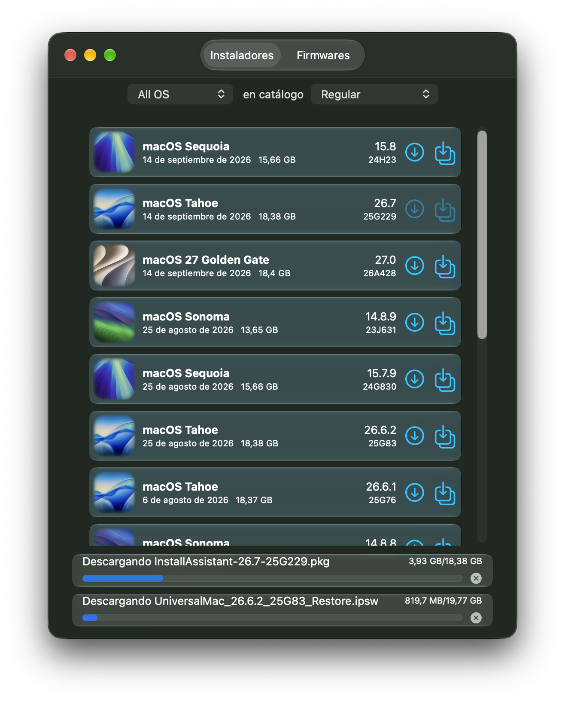
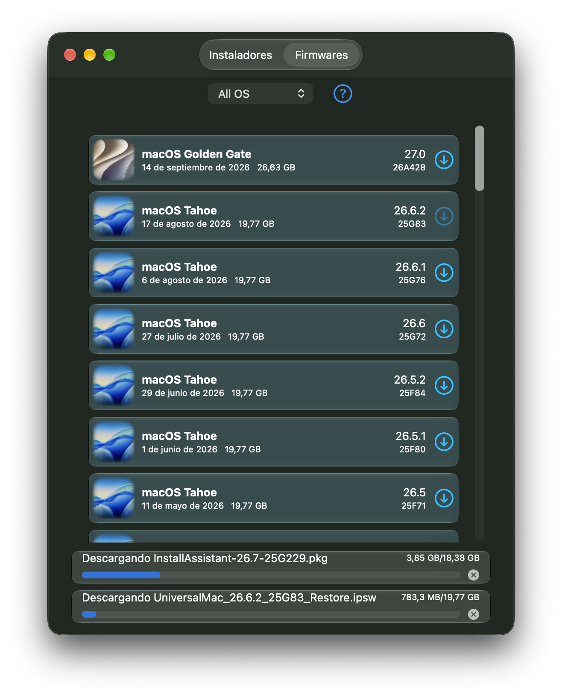
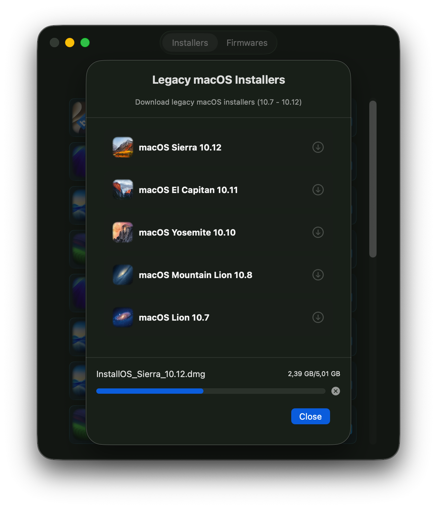
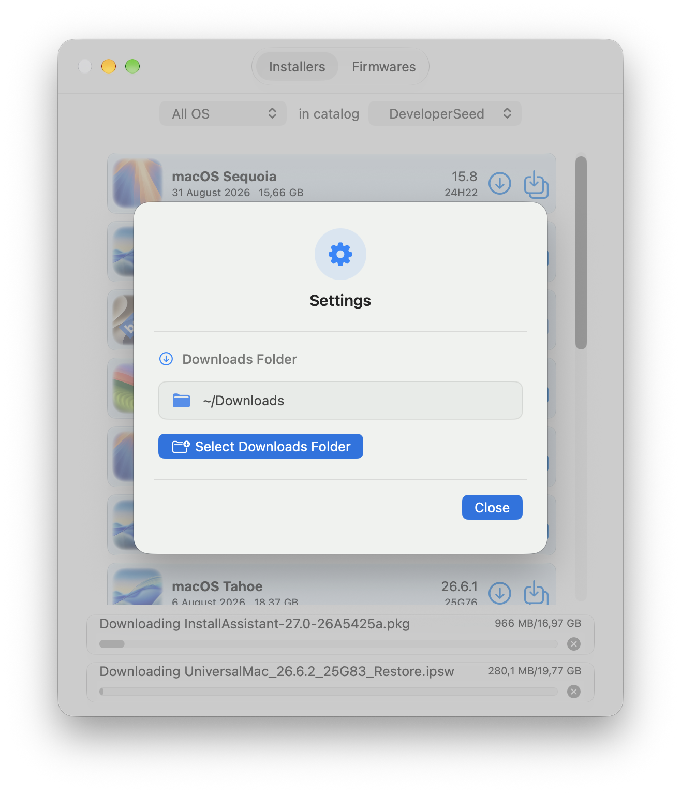
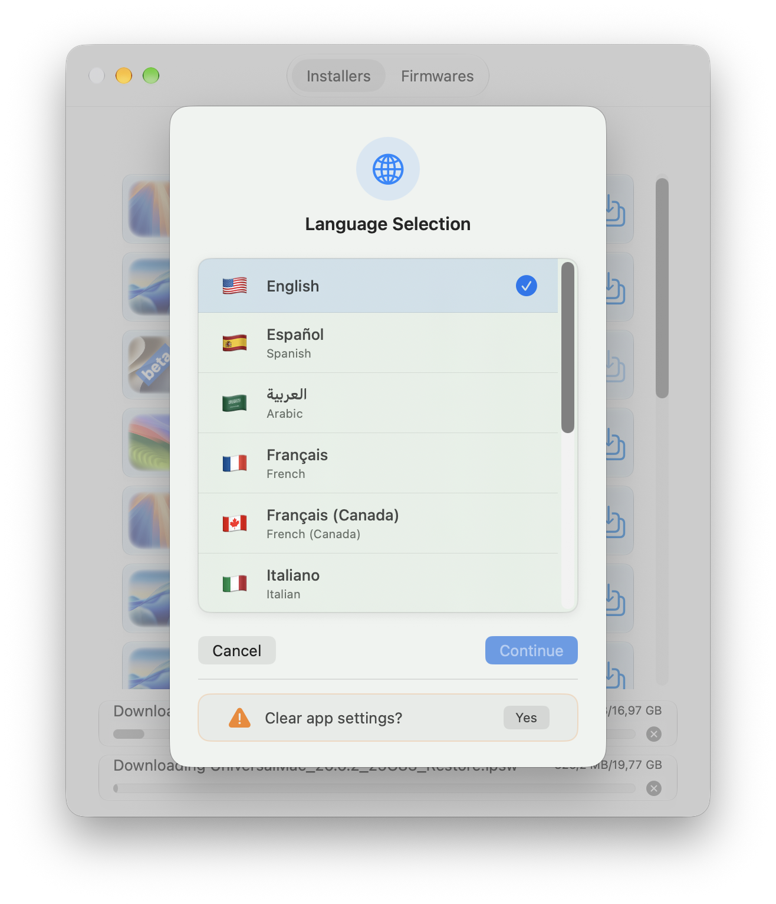

# Descargar el instalador completo

**Download Full Installer** es una aplicación para macOS escrita en SwiftUI 6 que descarga instaladores PKG o firmwares IPSW para la aplicación **Instalar macOS Big Sur** y versiones posteriores. Funciona en macOS 15 Sequoia y versiones posteriores.

**Versiones**:

- Si prefieres la versión desarrollada con Swift 6, que funciona en macOS 15 o versiones posteriores, obtén el código del proyecto desde la rama `main` o la versión 5.x.x en la página de [versiones](https://github.com/perez987/DownloadFullInstaller/releases)
- Hay una versión 2.5.3, desarrollada con Swift 5, que funciona en macOS Big Sur o posterior, obtén el código fuente o la app notarizada en la página de [versiones](https://github.com/perez987/DownloadFullInstaller/releases/tag/2.5.3)

|     |
| --- |
|  |
|  |

### Prefacio

A partir de junio de 2025, [DownloadFullInstaller](https://github.com/scriptingosx/DownloadFullInstaller) dejó de desarrollarse. Durante más de tres años, mi repositorio fue un `fork` del original. Sin embargo, tras archivarse el original, creé un nuevo repositorio como versión independiente (<em>no es un `fork`</em>).

Este repositorio existe para mantener viva y en evolución «Download Full Installer». Retoma el proyecto donde lo dejó el original, integrando PR de la comunidad y añadiendo nuevas funcionalidades. Mantendré este proyecto activo y actualizado mientras siga siendo útil para otros usuarios. Todo el mérito de la idea y la arquitectura originales corresponde a <em>scriptingosx</em>.

### Características

- Objetivo y requisitos
   - macOS 15 Sequoia como mínimo (hasta macOS Golden Gate)
   - Swift 6
   - Xcode 26
- Interfaz principal
   - Añade una pestaña de firmwares para Apple Silicon para descargar archivos IPSW y restaurar Mac con T2 o Apple Silicon
   - Se ha actualizado la interfaz mediante efecto glass, colores suaves y gradientes
- Preferencias
   - Las preferencias para elegir el catálogo ya no están en un cuadro de diálogo independiente, sino en la parte superior de la ventana principal
   - Se puede mostrar una única versión de macOS o todas las versiones a la vez
- Reposo del sistema
   - Añade lógica para impedir que el sistema entre en reposo mientras la aplicación está en ejecución
- Descargas
   - Añade la funcionalidad de reanudación de descargas, que gestiona automáticamente las interrupciones de red
   - Añade una barra de progreso superpuesta al icono de la aplicación en el Dock durante las descargas de PKG
   - Añade compatibilidad con hasta 3 descargas simultáneas
   - Añade selección personalizable de la carpeta de descargas
   - Limpia las descargas incompletas al salir de la aplicación
- Idiomas
  - Añade un sistema de selección de idioma
  - Actualiza las traducciones
- macOS obsoletos
  - Añade compatibilidad con instaladores de macOS heredado (10.7-10.12); consulta [este documento](DOCS/Legacy-macos.md)
- Actualizador
  - Añade el sistema de actualización Sparkle (Swift Package Manager) para comprobar si hay nuevas versiones
- Seguridad
   - La aplicación está aislada (`sandboxed`)
   - La aplicación está notarizada por Apple.

### Descarga de instaladores de macOS obsoletos

Se ha añadido un nuevo elemento llamado Legacy a la lista desplegable de sistemas macOS. Legacy abre una nueva ventana que muestra las cinco versiones disponibles de macOS obsoletos de los que existe un enlace directo para descargarlos. Puedes descargar cualquiera de estas versiones de macOS desde esa ventana.

|     |
| --- |
|  |

### Función para crear la aplicación del instalador

Después de descargar un archivo `InstallAssistant.pkg`, puedes crear la aplicación del instalador de macOS (por ejemplo, «Instalar macOS Sequoia.app») directamente desde Download Full Installer:

1. Descarga el PKG con el botón de descarga (↓)
2. Haz clic en el botón «Crear App de Instalación» junto al botón de descarga
3. El archivo PKG se abrirá con el instalador estándar de macOS
4. Sigue las instrucciones en pantalla para completar la instalación
5. La aplicación del instalador de macOS se creará en la carpeta `/Applications`.

### Ajustes para seleccionar la carpeta de descargas

El menú Download Full Installer -> Ajustes (⌘ ,) abre una ventana en la que puedes seleccionar una carpeta diferente para descargar los instaladores. La predeterminada es ~/Descargas. Los indicadores visuales (marcas verdes) de los instaladores descargados se actualizan para coincidir con los de la carpeta seleccionada.

|     |
| --- |
|  |

### Ventana del selector de idioma

El selector de idioma puede abrirse desde la barra de menús (`Languages` > `Select Language`) o mediante el atajo de teclado (`⌘ + L`).

|     |
| --- |
|  |

### Limpiar descargas incompletas al salir de la aplicación

Las descargas incompletas pueden acumularse en el directorio temporal 
`~/Library/Containers/perez987.DownloadFullInstaller/Data/tmp` 
consumiendo espacio en disco indefinidamente. La limpieza elimina de forma segura archivos normales (no directorios) definidos por `NSTemporaryDirectory()`, que se resuelve en la ruta temporal `sandboxed`. Los errores al eliminar archivos individuales no detienen el proceso de limpieza general.

<!--### La aplicación está dañada y no se puede abrir

Si ves este mensaje al abrir Download Full Installer por primera vez:
 `La aplicación está dañada y no se puede abrir.` 
O este otro:
 `No se ha podido verificar que Download Full Installer no contenga software malicioso.` 
Con la recomendación en ambos casos de mover el archivo a la Papelera, lee [este documento](DOCS/App-damaged.md). -->

# README del repositorio original
(por *scriptingosx*)

### Prefacio

Esta es una implementación en SwiftUI del script [fetch-installer-pkg](https://github.com/scriptingosx/fetch-installer-pkg) de *scriptingosx*. Mostrará los PKG completos del instalador de macOS Big Sur (y versiones posteriores) disponibles para descargar en los catálogos de actualización de software de Apple. Después podrás elegir uno de ellos para descargarlo.

### Motivación

Es posible que quieras descargar el PKG del instalador en lugar de la aplicación del instalador directamente porque deseas volver a desplegar la aplicación del instalador mediante un sistema de gestión, como Jamf.

Dado que la aplicación del instalador de macOS Big Sur contiene un único archivo de más de 8 GB, las herramientas de empaquetado habituales fallarán. He descrito el problema y algunas soluciones en detalle en [esta publicación del blog](https://scriptingosx.com/2020/11/deploying-the-big-sur-installer-application/).

### Extras

- Copia la URL de descarga de un PKG de instalador concreto desde el menú contextual
- Cambia el catálogo en el menú desplegable de Preferencias
- Crea la aplicación del instalador directamente desde el PKG descargado sin salir de la aplicación.

### Preguntas

#### ¿Puede descargar versiones antiguas de la aplicación del instalador de macOS?

No. Apple solo proporciona PKG de instaladores para Big Sur y versiones posteriores. Las versiones anteriores del instalador de Big Sur se eliminan regularmente.

#### ¿Lo actualizarás para que pueda descargar versiones antiguas?

No.

#### ¿En qué se diferencia de otras herramientas de línea de comandos?

Por lo que sé, descarga el mismo PKG que `softwareupdate --fetch-full-installer` e `installinstallmacOS.py`.

La diferencia es que las otras herramientas realizan inmediatamente la instalación, de modo que obtienes la aplicación del instalador en la carpeta `/Applications`. Esta herramienta solo descarga el PKG, por lo que puedes usarlo en tu sistema de gestión, archivar el PKG del instalador o ejecutar manualmente la instalación.

### Créditos

- Tanto [fetch-installer-pkg](https://github.com/scriptingosx/fetch-installer-pkg) como esta aplicación se basan en el script [installinstallmacos.py de Greg Neagle](https://github.com/munki/macadmin-scripts/blob/main/installinstallmacos.py).
- Gracias a [matxpa](https://github.com/matxpa): correcciones y mejoras en la versión 2.0.
