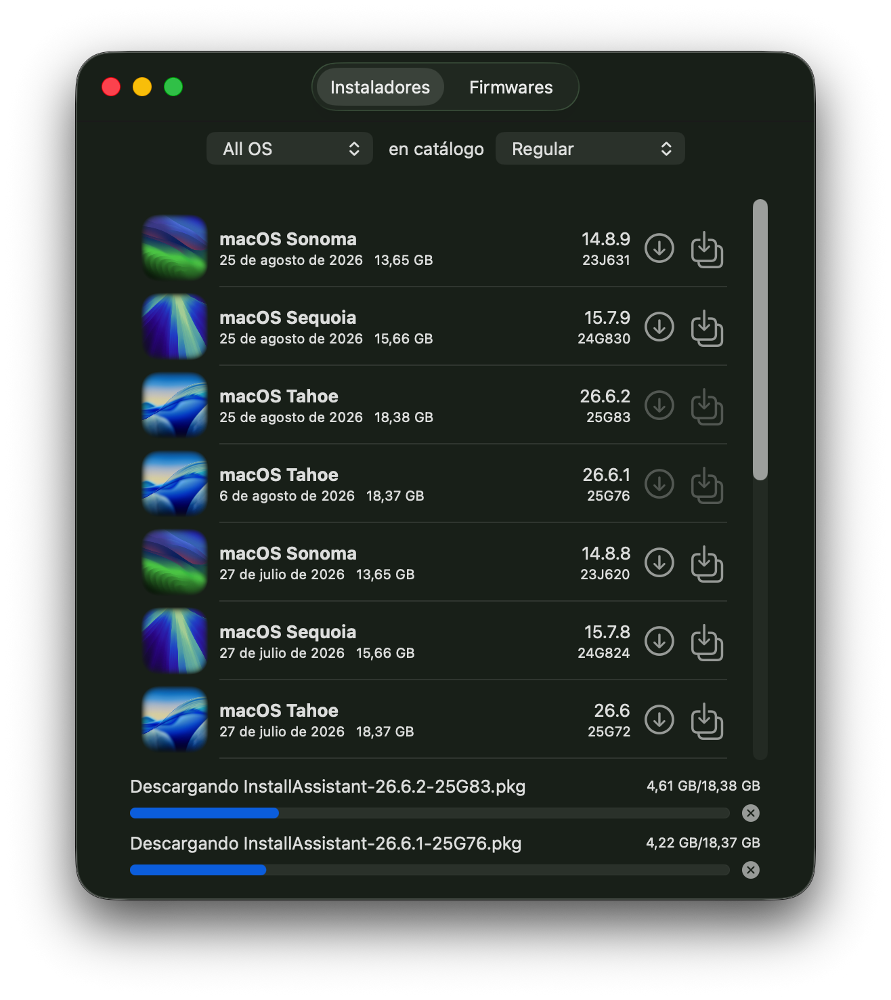
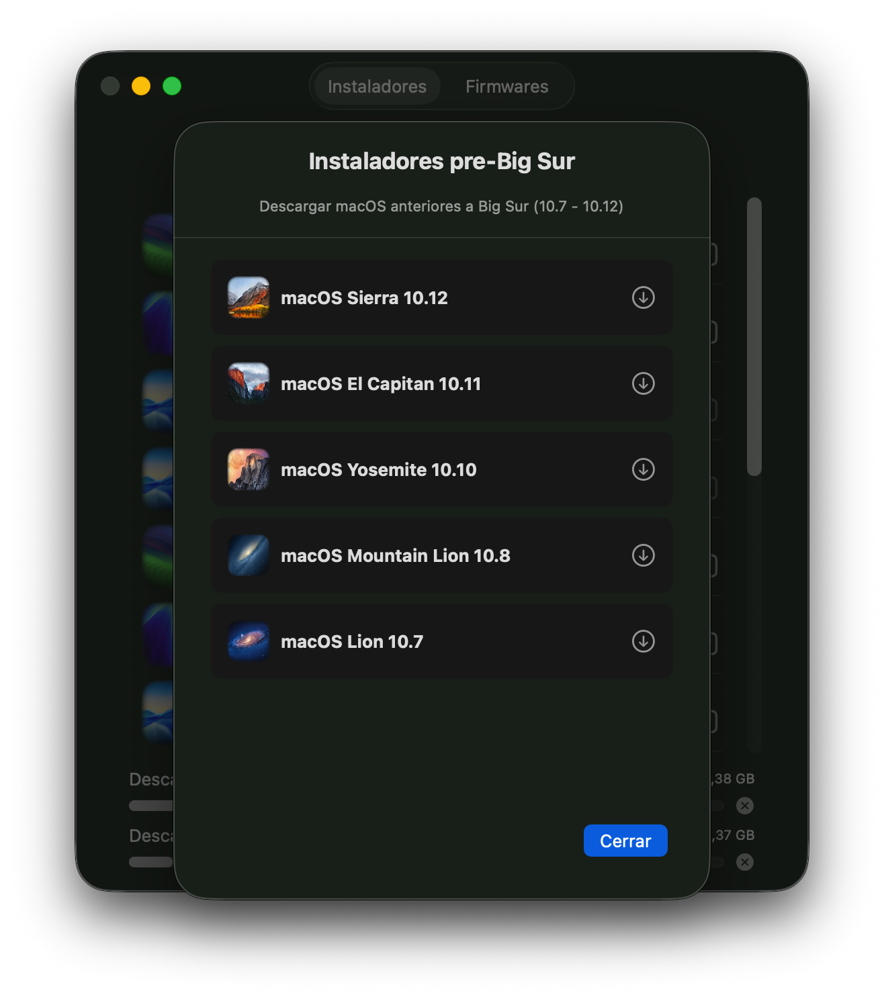
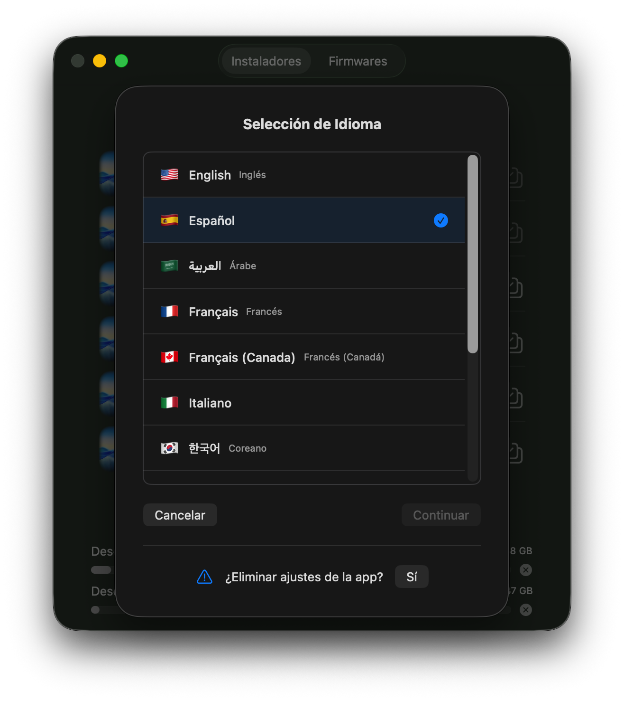

# Download Full Installer

**Download Full Installer** es una aplicación macOS escrita en SwiftUI que descarga instaladores PKG o firmwares IPSW para la aplicación **Install macOS Big Sur** y versiones posteriores. Funciona en macOS 13 Ventura hasta macOS 27 Golden Gate.

|     |
| --- |
|  |

### Prefacio

En junio de 2025, [DownloadFullInstaller](https://github.com/scriptingosx/DownloadFullInstaller) dejó de recibir actualizaciones. 
Durante más de tres años, mi repositorio fue un *fork* del original. Sin embargo, tras ser archivado el original, creé un nuevo repositorio como versión independiente (<em>sin ser *fork*</em>). 
Este repositorio existe para mantener "Download Full Installer" vivo y en crecimiento. Retomando donde el original lo dejó, integrando PRs de la comunidad y añadiendo nuevas funcionalidades. Mantendré este proyecto activo y actualizado mientras sea útil para otros usuarios. 
Todo el mérito por la idea original y la arquitectura es de <em>scriptingosx</em>.

### Características

- Objetivo y requisitos
   - macOS mínimo: Ventura 13
   - Actualización hasta macOS 27 Golden Gate
   - Xcode 15 requiere macOS 13 Ventura o posterior
- Interfaz principal
   - Pestaña de firmwares Silicon para descargar archivos IPSW y restaurar Macs T2 o Silicon
- Preferencias
   - Las preferencias para elegir el catálogo ya no son un diálogo separado, sino que se encuentran en la parte superior de la ventana principal
   - Se puede mostrar una única versión de macOS o todas a la vez
- Suspensión del sistema
   - Se añade lógica de prevención de suspensión para evitar que el sistema se duerma mientras la aplicación está en ejecución
- Descargas
   - Funcionalidad de reanudación de descargas que gestiona automáticamente las interrupciones de red
   - Barra de progreso superpuesta al icono del Dock durante las descargas de PKG
   - Soporte para hasta 3 descargas simultáneas
   - Carpeta de descarga personalizable
  - Limpieza de descargas incompletas al cerrar la aplicación
- Idiomas
  - Sistema de selección de idioma
  - Traducciones actualizadas
- macOS heredado
  - Soporte para instaladores de macOS heredados (10.7-10.12); consulta [este documento](DOCS/Legacy-macos.md)
- Actualizaciones
  - Sistema de actualización Sparkle (Swift Package Manager) para comprobar nuevas versiones
- Seguridad
   - La app está en sandbox
   - La app está notarizada por Apple.

### Descarga de instaladores de macOS obsoletos

Se ha añadido un nuevo elemento llamado «Legacy» a la lista desplegable de sistemas macOS. Legacy abre una nueva ventana que lista las cinco versiones de macOS antiguos disponibles, cada una con su propio enlace de descarga directa. Puedes descargar cualquiera de estas versiones desde esta ventana.

|    |    |
|:---:|:---:|
|  |

### Función «Crear aplicación instaladora»

Tras descargar un archivo `InstallAssistant.pkg`, puedes crear la aplicación instaladora de macOS (p. ej., "Install macOS Sequoia.app") directamente desde Download Full Installer:

1. Descarga el PKG con el botón de descarga (↓)
2. Haz clic en el botón «Crear aplicación instaladora» junto al botón de descarga
3. El archivo PKG se abrirá con el instalador estándar de macOS
4. Sigue las instrucciones en pantalla para completar la instalación
5. La aplicación instaladora de macOS se creará en la carpeta `/Aplicaciones`.

### Configuración para seleccionar la carpeta de descargas

Download Full Installer → menú Ajustes (⌘ ,) abre una ventana donde puedes seleccionar una carpeta diferente para descargar los instaladores. El valor predeterminado es ~/Descargas. Los indicadores visuales (marcas verdes) de los instaladores descargados se actualizan para reflejar los que ya están descargados en la carpeta seleccionada.

### Ventana de selección de idioma

El selector de idioma se puede abrir desde la barra de menús (`Idiomas` > `Seleccionar idioma`) o mediante atajo de teclado (`⌘ + L`).

|     |
| --- |
|  |

### Limpieza de descargas incompletas al cerrar la aplicación

Las descargas incompletas pueden acumularse en el directorio temporal de sandbox 
`~/Biblioteca/Containers/perez987.DownloadFullInstaller/Data/tmp` 
consumiendo espacio en disco indefinidamente. La limpieza elimina de forma segura los archivos regulares (no los directorios) de `NSTemporaryDirectory`, que se resuelve en la ruta temporal del sandbox. Los fallos al eliminar archivos individuales no detienen el proceso de limpieza general.

# README del repositorio original
(por *scriptingosx*)

### Prefacio

Esta es una implementación en Swift UI del script [fetch-installer-pkg](https://github.com/scriptingosx/fetch-installer-pkg) de *scriptingosx*. Lista los PKG completos del instalador de macOS Big Sur (y versiones posteriores) disponibles para descargar en los catálogos de actualización de software de Apple. A continuación, puedes elegir descargar uno de ellos.

### Motivación

Es posible que prefieras descargar el PKG del instalador en lugar de la aplicación instaladora directamente, porque quieres redistribuir la aplicación instaladora con un sistema de gestión, como Jamf.

Dado que la aplicación instaladora de macOS Big Sur contiene un único archivo de más de 8 GB, las herramientas habituales de empaquetado fallarán. He descrito el problema y algunas soluciones en detalle en [esta entrada del blog](https://scriptingosx.com/2020/11/deploying-the-big-sur-installer-application/).

### Extras

- Copia la URL de descarga de un PKG instalador determinado desde el menú contextual.
- Cambia el catálogo en el menú desplegable.
- Crea la aplicación instaladora directamente desde el PKG descargado sin salir de la aplicación.

### Preguntas

#### ¿Puede descargar versiones anteriores de la aplicación instaladora de macOS?

No. Apple solo proporciona PKG de instalador para Big Sur y versiones posteriores. Las versiones anteriores del instalador de Big Sur se eliminan periódicamente.

#### ¿Lo actualizarás para que pueda descargar versiones anteriores?

No.

#### ¿En qué se diferencia de otras herramientas de línea de comandos?

Hasta donde sé, descarga el mismo PKG que `softwareupdate --fetch-full-installer` e `installinstallmacOS.py`.

La diferencia es que las otras herramientas realizan la instalación inmediatamente a continuación, de modo que obtienes la aplicación instaladora en la carpeta `/Applications`. Esta herramienta solo descarga el PKG, para que puedas usarlo en tu sistema de gestión, archivar el PKG del instalador o ejecutar la instalación manualmente.

### Créditos

- Tanto [fetch-installer-pkg](https://github.com/scriptingosx/fetch-installer-pkg) como esta aplicación están basados en el script [installinstallmacos.py de Greg Neagle](https://github.com/munki/macadmin-scripts/blob/main/installinstallmacos.py).
- Gracias a [matxpa](https://github.com/matxpa): correcciones y mejoras en la versión 2.0.
 