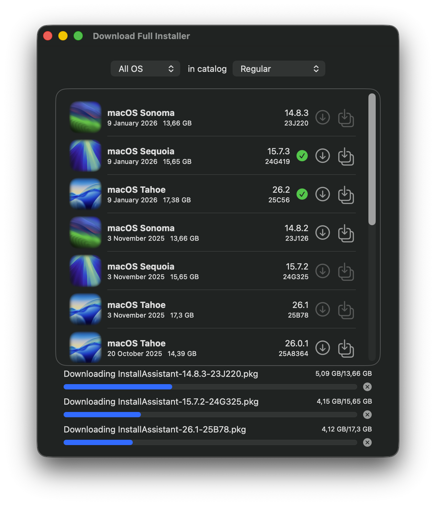
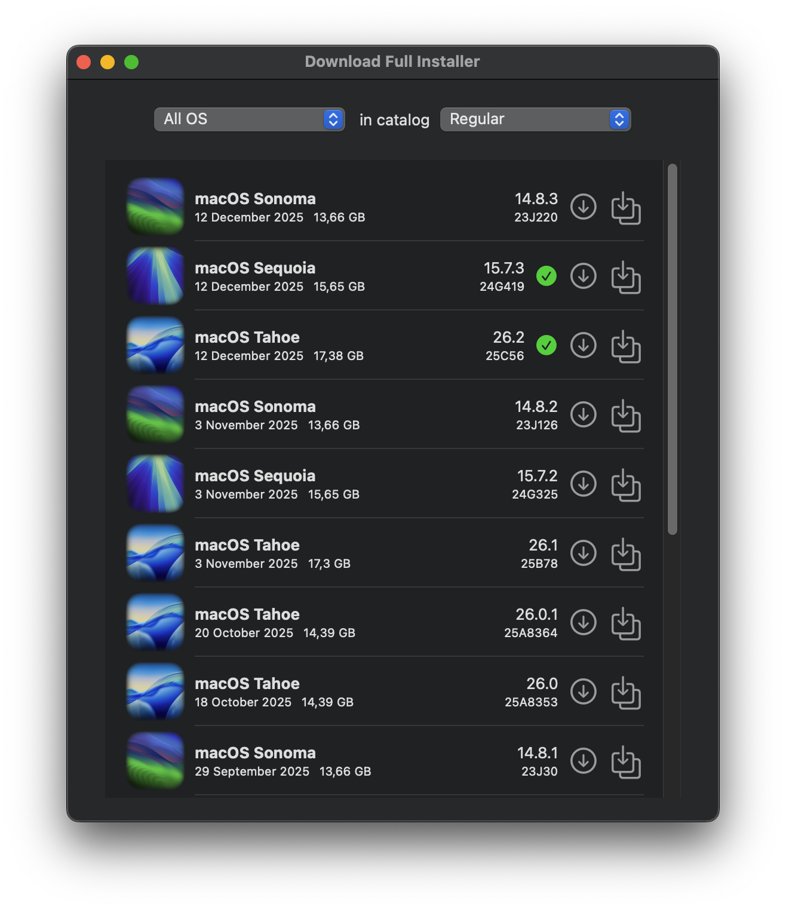
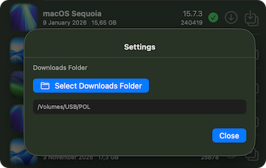
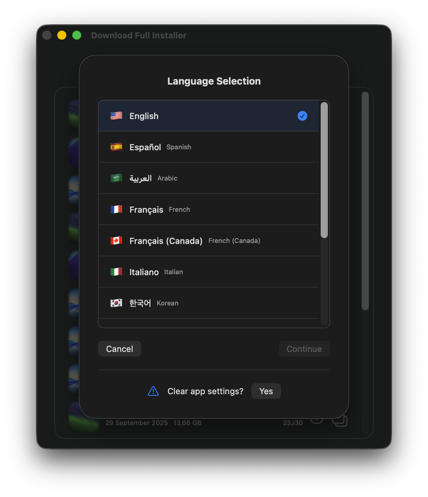

# Download Full Installer


<a href="README-ES.md">
    <br><br>

As of June 2025, [DownloadFullInstaller](https://github.com/scriptingosx/DownloadFullInstaller) by <em>scriptingosx</em> has been archived by the developer. For over three years, my DownloadFullInstaller repo was a fork of the source. However, after it was archived, I created a new repo. This new repo is a standalone (<em>not forked</em>) version. I'll keep this project active and up to date as long as it is useful to other users.





### Download Full Installer from macOS 13 up to 26 

Download Full Installer runs on macOS 13 Ventura through macOS 26 Tahoe.

**Note**: For Download Full Installer running on macOS 11+, you can get the [version 2.0](https://github.com/perez987/DownloadFullInstaller/releases/tag/2.5-173) or the Xcode project from the [`old`](https://github.com/perez987/DownloadFullInstaller/tree/old) branch and build the app from source.

### Features

- Updated up to macOS 26 Tahoe
- Xcode project requires macOS 13 Ventura or newer
- Preferences for choosing catalog are no longer a separate dialog but are now at the top of the main window
- A single macOS version or all versions can be displayed at once
- Added sleep prevention logic to avoid sleeping while the application is running
- Added language selection system
- Updated translations
- ~~Initial support for Liquid Glass~~
- Added download resume functionality that automatically handles network interruptions
- Added progress bar overlaying to the application's dock tile icon during PKG downloads
- Added support for up to 3 simultaneous downloads
- Added customizable download folder selection

#### Create Installer App Feature

After downloading an InstallAssistant.pkg file, you can create the macOS installer application (e.g., "Install macOS Sequoia.app") directly from within Download Full Installer:

1. Download the PKG using the download button (↓)
2. Click the "Create Installer App" button next to the download button
3. The PKG file will open with the standard macOS installer
4. Follow the on-screen instructions to complete the installation
5. The macOS installer app will be created in the `/Applications` folder

#### Settings to select downloads folder

The About This Hack -> Settings menu (⌘ ,) opens a window where you can select a different folder to download installers. Default is ~/Downloads. Visual indicators (green marks) of downloaded installers are updated to match those in the selected folder.



#### Language selector window

The language selector can be opened from the menubar (`Languages` > `Select Language`) or by keyboard shortcut (`⌘ + L`).



### App is damaged and can't be opened

If you see `App is damaged and can't be opened` when you open Download Full Installer for the first time, read this [document](DOCS/App-damaged.md).

# Original repository README
(by scriptingosx)

### Preface

This is a Swift UI implementation of the *scriptingosx*'s [fetch-installer-pkg](https://github.com/scriptingosx/fetch-installer-pkg) script. It will list the full macOS Big Sur (and later) installer pkgs available for download in Apple's software update catalogs. You can then choose to download one of them.

### Motivation

You may want to download the installer pkg instead of the installer application directly, because you want to re-deploy the installer application with a management system, such as Jamf. 

Since the Big Sur macOS installer application contains a single file larger than 8GB, normal packaging tools will fail. I have described the problem and some solutions in detail in [this blog post](https://scriptingosx.com/2020/11/deploying-the-big-sur-installer-application/).

### Extras

- Copy the download URL for a given installer pkg from the context menu.
- Change the seed program in the Preferences dropdown menu.
- Create the installer app directly from the downloaded PKG without leaving the application.

### Questions

#### Can this download older versions of the macOS installer application?

No. Apple only provides installer PKGs for Big Sur and later. Earlier versions of the Big Sur installer are removed regularly.

#### Will you update this so it can download older versions?

No.

#### How is this different from other command tools?

As far as I can tell, this downloads the same pkg as `softwareupdate --fetch-full-installer` and `installinstallmacOS.py`.

The difference is that the other tools then immediately perform the installation so that you get the installer application in the `/Applications` folder. This tool just downloads the pkg, so you can use it in your management system, archive the installer pkg, or manually run the installation.

<!-- Commented as obsolete
#### Skip sleep while downloading the installer

> **Note**: In August 2025, this has been superseded by Swift code integrated into the app.

Download Full Installer does not prevent the system from going to sleep while an installer is being downloaded. You can prevent this with the `caffeinate` command:

- open Terminal
- type `top | grep "Download"`
- stop `top` with Ctrl + C
- the output shows at the beginning of each line the PID of Download Full Installer
- type `caffeinate -w PID`(where PID is a number)
- sleep is blocked until Download Full Installer is closed.

``` bash
/Users/yo > top | grep "Download"
2233  Download Full In (more text...)
#stop with Ctrl + C
/Users/yo > caffeinate -w 2233
```
-->

### Credits

- Both [fetch-installer-pkg](https://github.com/scriptingosx/fetch-installer-pkg) and this application are based on [Greg Neagle's installinstallmacos.py](https://github.com/munki/macadmin-scripts/blob/main/installinstallmacos.py) script.
- Thanks to [matxpa](https://github.com/matxpa): fixes and improvements in version 2.0.
