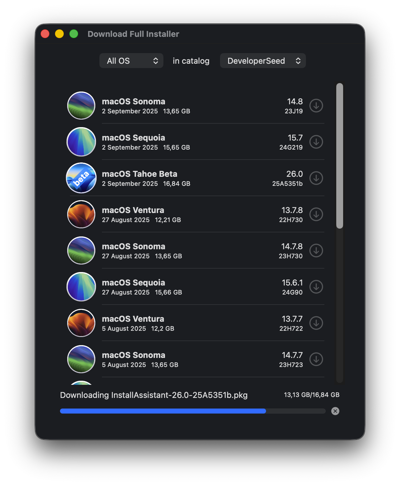

# Download Full Installer 2


<!--


<!-- 
 
[](https://deepwiki.com/perez987/DownloadFullInstaller-2)
 -->

**Note**: As of June 2025, [DownloadFullInstaller](https://github.com/scriptingosx/DownloadFullInstaller) by <em>scriptingosx</em> (no movement in more than 3 years) has been archived by the developer. This DownloadFullInstaller-2 repo is a standalone (<em>not forked</em>) version. I'll keep my repo active and up to date as long as it is useful to other users.



### Download Full Installer from macOS 11 up to 26 

DownloadFullInstaller runs on macOS 11 Big Sur through macOS 26 Tahoe. Tested only on macOS Ventura and later, as I don't have Big Sur or Monterey systems.

### test branch

Differences with the `main` branch:

- Xcode project requires macOS Sequoia or Tahoe.
- Add flag icons to languages in language selection view.
- Bump project version to 2.0.7.


### Preface

This is a Swift UI implementation of the [fetch-installer-pkg](https://github.com/scriptingosx/fetch-installer-pkg) script. It will list the full macOS Big Sur (and later) installer pkgs available for download in Apple's software update catalogs.

You can then choose to download one of them.

### Notes about version 2.0

As of December 2025, user [matxpa](https://github.com/matxpa) has modified this app by updating it to the most recent versions of macOS, fixing issues and adding improvements, hence the change to version 2.0:

* Improved Swift code
* Updated up to macOS 15 Sequoia
* Fixed an issue that fixed beta versions displayed in wrong catalogs. Beta word is applied to the icon if the official version has not released yet
* Preferences for choosing catalog are no longer a separate dialog but are now at the top of the main window
* A single macOS version or all versions can be displayed at once.

### Motivation

You may want to download the installer pkg instead of the installer application directly, because you want to re-deploy the installer application with a management system, such as Jamf. 

Since the Big Sur macOS installer application contains a single file larger than 8GB, normal packaging tools will fail. I have described the problem and some solutions in detail in [this blog post](https://scriptingosx.com/2020/11/deploying-the-big-sur-installer-application/).

### Extras

- Copy the download URL for a given installer pkg from the context menu.
- Change the seed program in the Preferences dropdown menu.

### Questions

#### Can this download older versions of the macOS installer application?

No. Apple only provides installer PKGs for Big Sur and later. Earlier versions of the Big Sur installer are removed regularly.

#### Will you update this so it can download older versions?

No.

#### How is this different from other command tools?

As far as I can tell, this downloads the same pkg as `softwareupdate --fetch-full-installer` and `installinstallmacOS.py`.

The difference is that the other tools then immediately perform the installation so that you get the installer application in the `/Applications` folder. This tool just downloads the pkg, so you can use it in your management system, archive the installer pkg, or manually run the installation.

<!-- Commented as obsolete
#### Skip sleep while downloading the installer

> **Note**: In August 2025, this has been superseded by Swift code integrated into the app.

Download Full Installer does not prevent the system from going to sleep while an installer is being downloaded. You can prevent this with the `caffeinate` command:

- open Terminal
- type `top | grep "Download"`
- stop `top` with Ctrl + C
- the output shows at the beginning of each line the PID of Download Full Installer
- type `caffeinate -w PID`(where PID is a number)
- sleep is blocked until Download Full Installer is closed.

``` bash
/Users/yo > top | grep "Download"
2233  Download Full In (more text...)
#stop with Ctrl + C
/Users/yo > caffeinate -w 2233
```
-->

### Credits

- Both [fetch-installer-pkg](https://github.com/scriptingosx/fetch-installer-pkg) and this application are based on [Greg Neagle's installinstallmacos.py](https://github.com/munki/macadmin-scripts/blob/main/installinstallmacos.py) script.
- Thanks to [matxpa](https://github.com/matxpa): fixes and improvements in version 2.0.
