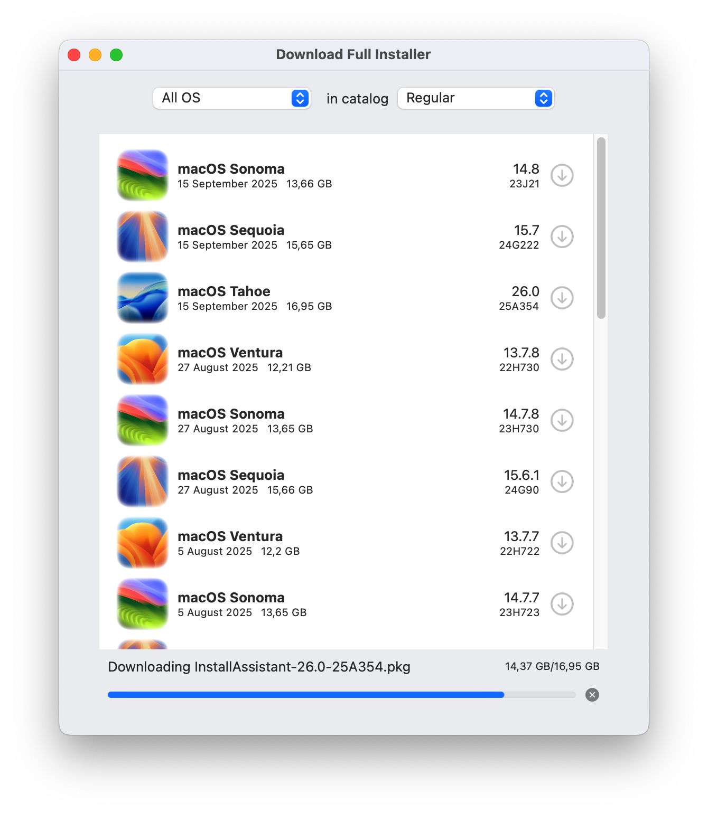
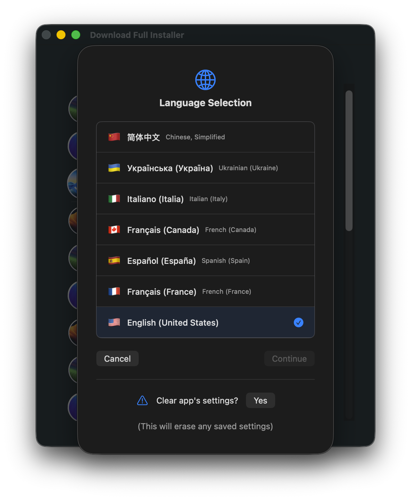
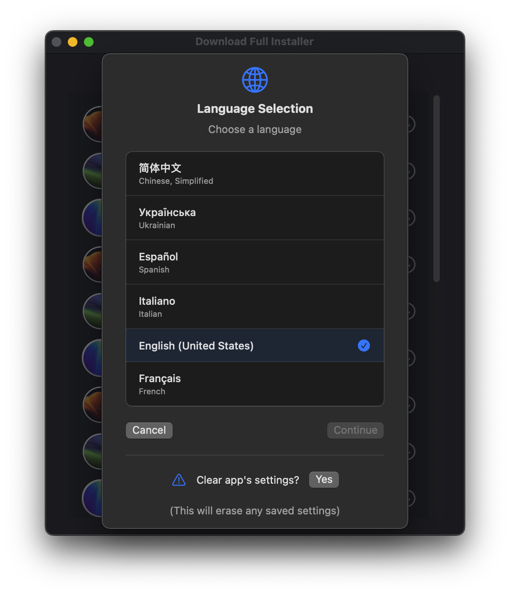

# Download Full Installer 2

[](https://github.com/perez987/DownloadFullInstaller-2/actions/workflows/Build.yml)


<!-- [](https://github.com/perez987/DownloadFullInstaller-2/blob/main/LICENSE)


<!-- 
 
[](https://deepwiki.com/perez987/DownloadFullInstaller-2)
 -->

As of June 2025, [DownloadFullInstaller](https://github.com/scriptingosx/DownloadFullInstaller) by <em>scriptingosx</em> has been archived by the developer. This DownloadFullInstaller-2 repo is a standalone (<em>not forked</em>) version. I'll keep my repo active and up to date as long as it is useful to other users.



### Download Full Installer from macOS 13 up to 26 

Download Full Installer runs on macOS 13 Ventura through macOS 26 Tahoe.

**Note**: For Download Full Installer running and compiling on macOS 11+, you can get the [1.9.0-83](https://github.com/perez987/DownloadFullInstaller-2/releases/tag/1.9.0-83) app version or the Xcode project from the [`old`](https://github.com/perez987/DownloadFullInstaller-2/tree/old) branch and build the app from source.

- Updated up to macOS 26 Tahoe
- Xcode project requires macOS Sequoia+
- Preferences for choosing catalog are no longer a separate dialog but are now at the top of the main window
- A single macOS version or all versions can be displayed at once
- Added sleep prevention logic to avoid sleep while app is running
- Added language selection system
- Updated translations with new strings
- Initial support for Liquid Glass with backward compatibility.

### App is damaged and can't be opened

If you see `App is damaged and can't be opened` when you open DownloadFullInstaller for the first time, read [this](App-damaged.md).

<!-- ### Notes about 2.0.7

- Xcode project requires macOS Sequoia or Tahoe.
- Bump project version to 2.0.7
- Added flag icons to languages in language selection view.-->

<!--  -->

<!-- ### Notes about version 2.0.5

- Updated up to macOS 26 Tahoe. 
- Xcode project requires macOS 13 Ventura or newer.
- Added language selection system.
- Added restart alert to language selection view.
- Updated translations with new strings.
- Added option to clear app's settings, stored in `~/Library/Containers/DownloadFullInstaller/Data/Library/Preferences`. -->

<!--  -->

<!-- ### Notes about version 2.0.0

GitHub user [matxpa](https://github.com/matxpa) was the main contributor at this stage.

* Updated up to macOS 15 Sequoia.
* Improved Swift code.
* Preferences for choosing catalog are no longer a separate dialpog but are now at the top of the main window.
* A single macOS version or all versions can be displayed at once.
* Fixed an issue with beta versions (displayed in wrong catalog). -->
<!-- * Beta word is overlaid on the installer icon if `product.title` contains `isBeta`. This happens when the official version of macOS hasn't been released yet. Beta versions after the official version of macOS don't have `isBeta` in `product.title`. Hence they do not have overlaid the word Beta. -->

## Original repository

### Preface

This is a Swift UI implementation of my [fetch-installer-pkg](https://github.com/scriptingosx/fetch-installer-pkg) script. It will list the full macOS Big Sur (and later) installer pkgs available for download in Apple's software update catalogs. You can then choose to download one of them.

### Motivation

You may want to download the installer pkg instead of the installer application directly, because you want to re-deploy the installer application with a management system, such as Jamf. 

Since the Big Sur macOS installer application contains a single file larger than 8GB, normal packaging tools will fail. I have described the problem and some solutions in detail in [this blog post](https://scriptingosx.com/2020/11/deploying-the-big-sur-installer-application/).

### Extras

- Copy the download URL for a given installer pkg from the context menu.
- Change the seed program in the Preferences dropdown menu.
- Create the installer without leaving the application.

### Questions

#### Can this download older versions of the macOS installer application?

No. Apple only provides installer PKGs for Big Sur and later. Earlier versions of the Big Sur installer are removed regularly.

#### Will you update this so it can download older versions?

No.

#### How is this different from other command tools?

As far as I can tell, this downloads the same pkg as `softwareupdate --fetch-full-installer` and `installinstallmacOS.py`.

The difference is that the other tools then immediately perform the installation so that you get the installer application in the `/Applications` folder. This tool just downloads the pkg, so you can use it in your management system, archive the installer pkg, or manually run the installation.

<!-- Commented as obsolete
#### Skip sleep while downloading the installer

> **Note**: In August 2025, this has been superseded by Swift code integrated into the app.

Download Full Installer does not prevent the system from going to sleep while an installer is being downloaded. You can prevent this with the `caffeinate` command:

- open Terminal
- type `top | grep "Download"`
- stop `top` with Ctrl + C
- the output shows at the beginning of each line the PID of Download Full Installer
- type `caffeinate -w PID`(where PID is a number)
- sleep is blocked until Download Full Installer is closed.

``` bash
/Users/yo > top | grep "Download"
2233  Download Full In (more text...)
#stop with Ctrl + C
/Users/yo > caffeinate -w 2233
```
-->

### Credits

- Both [fetch-installer-pkg](https://github.com/scriptingosx/fetch-installer-pkg) and this application are based on [Greg Neagle's installinstallmacos.py](https://github.com/munki/macadmin-scripts/blob/main/installinstallmacos.py) script.
- Thanks to [matxpa](https://github.com/matxpa): fixes and improvements in version 2.0.
