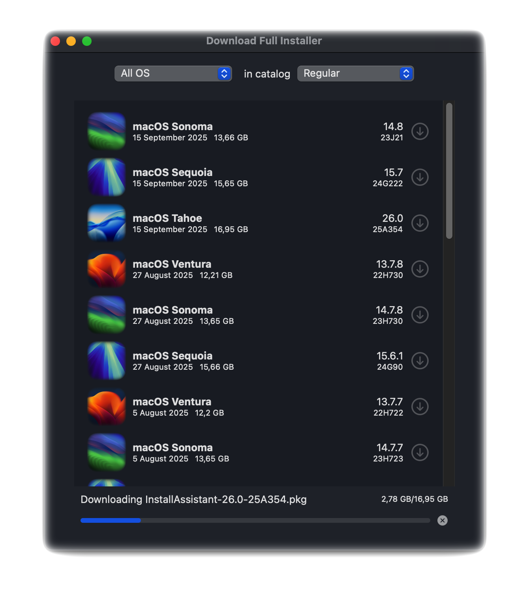

# Download Full Installer




As of June 2025, [DownloadFullInstaller](https://github.com/scriptingosx/DownloadFullInstaller) by <em>scriptingosx</em> has been archived by the developer. For over three years, my DownloadFullInstaller repo was a fork of the source. However, after it was archived, I created a new repo. This new repo is a standalone (<em>not forked</em>) version. I'll keep this project active and up to date as long as it is useful to other users.

## Download Full Installer for macOS 11+ 

This branch of DownloadFullInstaller runs on macOS 11 Big Sur up to macOS 26 Tahoe.

- Platform:
	- DownloadFullInstaller.app runs on macOS 11+.
	- Xcode requires macOS 11 or newer.
- Add constants, icons and URL catalog for Tahoe.
- Add sleep prevention logic:
	- Disable sleep while the app is open.
	- Sleep resumes when the app is closed.
- A single macOS version or all versions can be displayed at once
- Prerences are no longer in a dialog but at the top of main view.
- Add languages: English, Spanish, French, Italian, Ukrainian, Russian and Simplified Chinese.
- Update copyright info
- Added download resume functionality that automatically handles network interruptions.

## Original repository README

### Preface

This is a Swift UI implementation of the *scriptingosx*'s [fetch-installer-pkg](https://github.com/scriptingosx/fetch-installer-pkg) script. It will list the full macOS Big Sur (and later) installer pkgs available for download in Apple's software update catalogs. You can then choose to download one of them.

### Motivation

You may want to download the installer pkg instead of the installer application directly, because you want to re-deploy the installer application with a management system, such as Jamf. 

Since the Big Sur macOS installer application contains a single file larger than 8GB, normal packaging tools will fail. I have described the problem and some solutions in detail in [this blog post](https://scriptingosx.com/2020/11/deploying-the-big-sur-installer-application/).

### Extras

- Copy the download URL for a given installer pkg from the context menu.
- Change the seed program in the Preferences dropdown menu.
- Create the installer without leaving the application.

### Questions

#### Can this download older versions of the macOS installer application?

No. Apple only provides installer PKGs for Big Sur and later. Earlier versions of the Big Sur installer are removed regularly.

#### Will you update this so it can download older versions?

No.

#### How is this different from other command tools?

As far as I can tell, this downloads the same pkg as `softwareupdate --fetch-full-installer` and `installinstallmacOS.py`.

The difference is that the other tools then immediately perform the installation so that you get the installer application in the `/Applications` folder. This tool just downloads the pkg, so you can use it in your management system, archive the installer pkg, or manually run the installation.

<!-- Commented as obsolete
#### Skip sleep while downloading the installer

> **Note**: In August 2025, this has been superseded by Swift code integrated into the app.

Download Full Installer does not prevent the system from going to sleep while an installer is being downloaded. You can prevent this with the `caffeinate` command:

- open Terminal
- type `top | grep "Download"`
- stop `top` with Ctrl + C
- the output shows at the beginning of each line the PID of Download Full Installer
- type `caffeinate -w PID`(where PID is a number)
- sleep is blocked until Download Full Installer is closed.

``` bash
/Users/yo > top | grep "Download"
2233  Download Full In (more text...)
#stop with Ctrl + C
/Users/yo > caffeinate -w 2233
```
-->

### Credits

- Both [fetch-installer-pkg](https://github.com/scriptingosx/fetch-installer-pkg) and this application are based on [Greg Neagle's installinstallmacos.py](https://github.com/munki/macadmin-scripts/blob/main/installinstallmacos.py) script.
